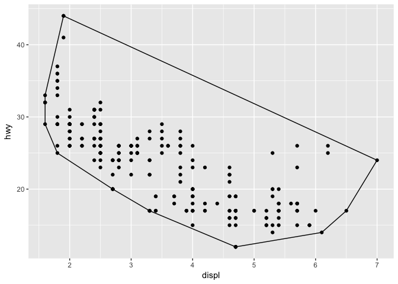
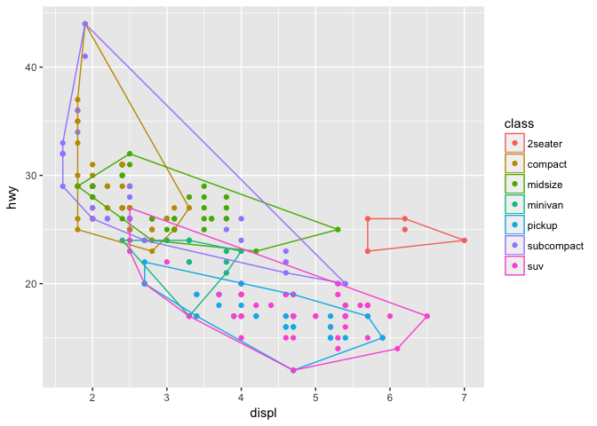

# Building the Hurricane Geom: playground
Pier Lorenzo Paracchini  
20 juni 2017  


### Experiment with the `geosphere` package

_'As a hint, notice that the wind radii geom essentially shows a polygon for each of the wind levels. One approach to writing this geom is therefore to write the hurricane stat / geom combination that uses the wind radii to calculate the points along the boundary of the polygon and then create a geom that inherits from a polygon geom.'_

__Point at distance and bearing__

As suggested the `destPoint` function can create polygons that can be used to map the wind extension in each quadrant. See the example below. 


```r
center <- c(-89.6, 29.5)
#p: longitude and latitude (degrees) of the starting point
#b: bearing in degress
#d: distance in meters
circle <- destPoint(center, b=0:365, d = 1000)

circle_ne <- destPoint(center, b=0:90, d=800)
circle_ne <- rbind(center, circle_ne)

circle_se <- destPoint(center, b=90:180, d=600)
circle_se <- rbind(center, circle_se)

circle_sw <- destPoint(center, b=180:270, d=400)
circle_sw <- rbind(center, circle_sw)

circle_nw <- destPoint(center, b=270:360, d=200)
circle_nw <- rbind(center, circle_nw)

plot(circle, type='l')
polygon(circle_ne, col = "red")
polygon(circle_se, col = "blue")
polygon(circle_sw, col = "gray")
polygon(circle_nw, col = "orange")
```

<!-- -->


## How to build a new geom


```
(1st) create a new class from the Geom class
 required_aes = <a character vector of required aesthetics>,
 default_aes = aes(<default values for certain aesthetics>),
 draw_key = <a function used to draw the key in the legend>,
 draw_panel = function(data, panel_scales, coord) {
   Function that returns a grid grob that will 
   be plotted (this is where the real work occurs)

(2nd) create the corrisponding geom function
```


### Example 1


```r
GeomMyPoint <- ggproto("GeomMyPoint", Geom, 
                 required_aes = c("x", "y"),
                 default_aes = aes(shape = 19),
                 draw_key = draw_key_point,
                 draw_panel = function(data, panel_scales, coord){
                   #Transform the data
                   coords <- coord$transform(data, panel_scales)
                   
                   #Print out the transofrmed data
                   str(coords)
                   
                   #Create a grid grob
                   pointsGrob(
                     x = coords$x,
                     y = coords$y,
                     pch = coords$shape
                   )
                 })

geom_mypoint <- function(mapping = NULL, data = NULL, stat = "identity",
                       position = "identity", na.rm = FALSE,
                       show.legend = NA, inherit.aes = TRUE, ...){
  layer(
    geom = GeomMyPoint, mapping = mapping,
    data = data, stat = stat, position = position,
    show.legend = show.legend, inherit.aes = inherit.aes,
    params = list(na.rm = na.rm,...)
  )
}

ggplot(data = worldcup, mapping = aes(x = Time, y = Shots)) + geom_mypoint()
```

<!-- -->

```
## 'data.frame':	595 obs. of  5 variables:
##  $ x    : num  0.0694 0.6046 0.3314 0.4752 0.1174 ...
##  $ y    : num  0.0455 0.0455 0.0455 0.0791 0.1128 ...
##  $ PANEL: int  1 1 1 1 1 1 1 1 1 1 ...
##  $ group: int  -1 -1 -1 -1 -1 -1 -1 -1 -1 -1 ...
##  $ shape: num  19 19 19 19 19 19 19 19 19 19 ...
##  - attr(*, "vars")= chr "PANEL"
```

### Example 2


```r
GeomAutoTransparent <- ggproto("GeomAutoTransparent", Geom, 
                 required_aes = c("x", "y"),
                 default_aes = aes(shape = 19),
                 draw_key = draw_key_point,
                 draw_panel = function(data, panel_scales, coord){
                   #Transform the data
                   coords <- coord$transform(data, panel_scales)
                   
                   #Print out the transofrmed data
                   str(coords)
                   
                   #Compute the transparency factor
                   n <- nrow(data)
                   
                   if(n > 100 && n <= 200){
                     coords$alpha <- 0.3
                   }else if(n > 200){
                     coords$alpha <- 0.15
                   }else{
                     coords$alpha <- 1
                   }
                   
                   #Print out the transofrmed data
                   str(coords)
                   
                   #Create a grid grob
                   pointsGrob(
                     x = coords$x,
                     y = coords$y,
                     pch = coords$shape,
                     gp = gpar(alpha = coords$alpha)
                   )
                 })

geom_tranparentpoint <- function(mapping = NULL, data = NULL, stat = "identity",
                       position = "identity", na.rm = FALSE,
                       show.legend = NA, inherit.aes = TRUE, ...){
  layer(
    geom = GeomAutoTransparent, mapping = mapping,
    data = data, stat = stat, position = position,
    show.legend = show.legend, inherit.aes = inherit.aes,
    params = list(na.rm = na.rm,...)
  )
}

ggplot(data = worldcup, mapping = aes(x = Time, y = Shots)) + 
  geom_tranparentpoint()
```

<!-- -->

```
## 'data.frame':	595 obs. of  5 variables:
##  $ x    : num  0.0694 0.6046 0.3314 0.4752 0.1174 ...
##  $ y    : num  0.0455 0.0455 0.0455 0.0791 0.1128 ...
##  $ PANEL: int  1 1 1 1 1 1 1 1 1 1 ...
##  $ group: int  -1 -1 -1 -1 -1 -1 -1 -1 -1 -1 ...
##  $ shape: num  19 19 19 19 19 19 19 19 19 19 ...
##  - attr(*, "vars")= chr "PANEL"
## 'data.frame':	595 obs. of  6 variables:
##  $ x    : num  0.0694 0.6046 0.3314 0.4752 0.1174 ...
##  $ y    : num  0.0455 0.0455 0.0455 0.0791 0.1128 ...
##  $ PANEL: int  1 1 1 1 1 1 1 1 1 1 ...
##  $ group: int  -1 -1 -1 -1 -1 -1 -1 -1 -1 -1 ...
##  $ shape: num  19 19 19 19 19 19 19 19 19 19 ...
##  $ alpha: num  0.15 0.15 0.15 0.15 0.15 0.15 0.15 0.15 0.15 0.15 ...
##  - attr(*, "vars")= chr "PANEL"

ggplot(data = worldcup[1:150,], mapping = aes(x = Time, y = Shots)) + 
  geom_tranparentpoint()
```

<!-- -->

```
## 'data.frame':	150 obs. of  5 variables:
##  $ x    : num  0.0694 0.6046 0.3314 0.4752 0.1174 ...
##  $ y    : num  0.0455 0.0455 0.0455 0.1061 0.1667 ...
##  $ PANEL: int  1 1 1 1 1 1 1 1 1 1 ...
##  $ group: int  -1 -1 -1 -1 -1 -1 -1 -1 -1 -1 ...
##  $ shape: num  19 19 19 19 19 19 19 19 19 19 ...
##  - attr(*, "vars")= chr "PANEL"
## 'data.frame':	150 obs. of  6 variables:
##  $ x    : num  0.0694 0.6046 0.3314 0.4752 0.1174 ...
##  $ y    : num  0.0455 0.0455 0.0455 0.1061 0.1667 ...
##  $ PANEL: int  1 1 1 1 1 1 1 1 1 1 ...
##  $ group: int  -1 -1 -1 -1 -1 -1 -1 -1 -1 -1 ...
##  $ shape: num  19 19 19 19 19 19 19 19 19 19 ...
##  $ alpha: num  0.3 0.3 0.3 0.3 0.3 0.3 0.3 0.3 0.3 0.3 ...
##  - attr(*, "vars")= chr "PANEL"

ggplot(data = worldcup[1:60,], mapping = aes(x = Time, y = Shots)) + 
  geom_tranparentpoint()
```

<!-- -->

```
## 'data.frame':	60 obs. of  5 variables:
##  $ x    : num  0.0694 0.6046 0.3314 0.4752 0.1174 ...
##  $ y    : num  0.0455 0.0455 0.0455 0.1212 0.197 ...
##  $ PANEL: int  1 1 1 1 1 1 1 1 1 1 ...
##  $ group: int  -1 -1 -1 -1 -1 -1 -1 -1 -1 -1 ...
##  $ shape: num  19 19 19 19 19 19 19 19 19 19 ...
##  - attr(*, "vars")= chr "PANEL"
## 'data.frame':	60 obs. of  6 variables:
##  $ x    : num  0.0694 0.6046 0.3314 0.4752 0.1174 ...
##  $ y    : num  0.0455 0.0455 0.0455 0.1212 0.197 ...
##  $ PANEL: int  1 1 1 1 1 1 1 1 1 1 ...
##  $ group: int  -1 -1 -1 -1 -1 -1 -1 -1 -1 -1 ...
##  $ shape: num  19 19 19 19 19 19 19 19 19 19 ...
##  $ alpha: num  1 1 1 1 1 1 1 1 1 1 ...
##  - attr(*, "vars")= chr "PANEL"

ggplot(data = worldcup, mapping = aes(x = Time, y = Shots)) + 
  geom_tranparentpoint() +
  facet_wrap(~ Position, ncol = 2)
```

<!-- -->

```
## 'data.frame':	188 obs. of  5 variables:
##  $ x    : num  0.331 0.264 0.208 0.475 0.132 ...
##  $ y    : num  0.0455 0.0455 0.0455 0.1128 0.0455 ...
##  $ PANEL: Factor w/ 4 levels "1","2","3","4": 1 1 1 1 1 1 1 1 1 1 ...
##  $ group: int  -1 -1 -1 -1 -1 -1 -1 -1 -1 -1 ...
##  $ shape: num  19 19 19 19 19 19 19 19 19 19 ...
##  - attr(*, "vars")= chr "PANEL"
## 'data.frame':	188 obs. of  6 variables:
##  $ x    : num  0.331 0.264 0.208 0.475 0.132 ...
##  $ y    : num  0.0455 0.0455 0.0455 0.1128 0.0455 ...
##  $ PANEL: Factor w/ 4 levels "1","2","3","4": 1 1 1 1 1 1 1 1 1 1 ...
##  $ group: int  -1 -1 -1 -1 -1 -1 -1 -1 -1 -1 ...
##  $ shape: num  19 19 19 19 19 19 19 19 19 19 ...
##  $ alpha: num  0.3 0.3 0.3 0.3 0.3 0.3 0.3 0.3 0.3 0.3 ...
##  - attr(*, "vars")= chr "PANEL"
## 'data.frame':	143 obs. of  5 variables:
##  $ x    : num  0.1174 0.1589 0.0966 0.2132 0.2611 ...
##  $ y    : num  0.1128 0.0455 0.0455 0.1128 0.2138 ...
##  $ PANEL: Factor w/ 4 levels "1","2","3","4": 2 2 2 2 2 2 2 2 2 2 ...
##  $ group: int  -1 -1 -1 -1 -1 -1 -1 -1 -1 -1 ...
##  $ shape: num  19 19 19 19 19 19 19 19 19 19 ...
##  - attr(*, "vars")= chr "PANEL"
## 'data.frame':	143 obs. of  6 variables:
##  $ x    : num  0.1174 0.1589 0.0966 0.2132 0.2611 ...
##  $ y    : num  0.1128 0.0455 0.0455 0.1128 0.2138 ...
##  $ PANEL: Factor w/ 4 levels "1","2","3","4": 2 2 2 2 2 2 2 2 2 2 ...
##  $ group: int  -1 -1 -1 -1 -1 -1 -1 -1 -1 -1 ...
##  $ shape: num  19 19 19 19 19 19 19 19 19 19 ...
##  $ alpha: num  0.3 0.3 0.3 0.3 0.3 0.3 0.3 0.3 0.3 0.3 ...
##  - attr(*, "vars")= chr "PANEL"
## 'data.frame':	36 obs. of  5 variables:
##  $ x    : num  0.475 0.475 0.619 0.116 0.907 ...
##  $ y    : num  0.0455 0.0455 0.0455 0.0455 0.0455 ...
##  $ PANEL: Factor w/ 4 levels "1","2","3","4": 3 3 3 3 3 3 3 3 3 3 ...
##  $ group: int  -1 -1 -1 -1 -1 -1 -1 -1 -1 -1 ...
##  $ shape: num  19 19 19 19 19 19 19 19 19 19 ...
##  - attr(*, "vars")= chr "PANEL"
## 'data.frame':	36 obs. of  6 variables:
##  $ x    : num  0.475 0.475 0.619 0.116 0.907 ...
##  $ y    : num  0.0455 0.0455 0.0455 0.0455 0.0455 ...
##  $ PANEL: Factor w/ 4 levels "1","2","3","4": 3 3 3 3 3 3 3 3 3 3 ...
##  $ group: int  -1 -1 -1 -1 -1 -1 -1 -1 -1 -1 ...
##  $ shape: num  19 19 19 19 19 19 19 19 19 19 ...
##  $ alpha: num  1 1 1 1 1 1 1 1 1 1 ...
##  - attr(*, "vars")= chr "PANEL"
## 'data.frame':	228 obs. of  5 variables:
##  $ x    : num  0.0694 0.6046 0.4752 0.0774 0.4752 ...
##  $ y    : num  0.0455 0.0455 0.0791 0.2138 0.0791 ...
##  $ PANEL: Factor w/ 4 levels "1","2","3","4": 4 4 4 4 4 4 4 4 4 4 ...
##  $ group: int  -1 -1 -1 -1 -1 -1 -1 -1 -1 -1 ...
##  $ shape: num  19 19 19 19 19 19 19 19 19 19 ...
##  - attr(*, "vars")= chr "PANEL"
## 'data.frame':	228 obs. of  6 variables:
##  $ x    : num  0.0694 0.6046 0.4752 0.0774 0.4752 ...
##  $ y    : num  0.0455 0.0455 0.0791 0.2138 0.0791 ...
##  $ PANEL: Factor w/ 4 levels "1","2","3","4": 4 4 4 4 4 4 4 4 4 4 ...
##  $ group: int  -1 -1 -1 -1 -1 -1 -1 -1 -1 -1 ...
##  $ shape: num  19 19 19 19 19 19 19 19 19 19 ...
##  $ alpha: num  0.15 0.15 0.15 0.15 0.15 0.15 0.15 0.15 0.15 0.15 ...
##  - attr(*, "vars")= chr "PANEL"
```

### Example 3

```
Overriding draw_panel() is most appropriate if there is one graphic element per row. In other cases, you want graphic element per group. For example, take polygons: each row gives one vertex of a polygon. In this case, you should instead override draw_group().
```


```r

StatChull <- ggproto("StatChull", Stat,
  compute_group = function(data, scales) {
    #str(data)
    tmp <- data[chull(data$x, data$y), , drop = FALSE]
    #str(tmp)
    return(tmp)
  },
  
  required_aes = c("x", "y")
)

stat_chull <- function(mapping = NULL, data = NULL, geom = "polygon",
                       position = "identity", na.rm = FALSE, show.legend = NA, 
                       inherit.aes = TRUE, ...) {
  layer(
    stat = StatChull, data = data, mapping = mapping, geom = geom, 
    position = position, show.legend = show.legend, inherit.aes = inherit.aes,
    params = list(na.rm = na.rm, ...)
  )
}

ggplot(mpg, aes(displ, hwy)) + 
  geom_point() + 
  stat_chull(fill = NA, colour = "black")
```

<!-- -->

```r


GeomSimplePolygon <- ggproto("GeomPolygon", Geom,
                             required_aes = c("x", "y"),
                             default_aes = aes(colour = NA, fill = "grey20", size = 0.5, linetype = 1, alpha = 1),
                             draw_key = draw_key_polygon,
                             draw_group = function(data, panel_scales, coord){
                               print("draw_group() ....")
                               n <- nrow(data)
                               if(n <= 2) return(grid::nullGrob())
                               
                               coords <- coord$transform(data, panel_scales)
                               str(coords)
                               
                               #A polygon can have only color, fill per polygon
                               first_row <- coords[1, ,drop = FALSE]
                               print(first_row)                               
                               grid::polygonGrob(
                                coords$x, coords$y, 
                                default.units = "native",
                                gp = grid::gpar(
                                  col = first_row$colour,
                                  fill = scales::alpha(first_row$fill, first_row$alpha),
                                  lwd = first_row$size * .pt,
                                  lty = first_row$linetype
                                )
                              )
                            }
)

geom_simple_polygon <- function(mapping = NULL, data = NULL, stat = "chull",
                                position = "identity", na.rm = FALSE, show.legend = NA, 
                                inherit.aes = TRUE, ...) {
  layer(
    geom = GeomSimplePolygon, mapping = mapping, data = data, stat = stat, 
    position = position, show.legend = show.legend, inherit.aes = inherit.aes,
    params = list(na.rm = na.rm, ...)
  )
}

ggplot(mpg, aes(displ, hwy)) + 
  geom_point(aes(colour = class)) + 
  geom_simple_polygon(aes(colour = class), fill = NA)
```

<!-- -->

```
## [1] "draw_group() ...."
## 'data.frame':	4 obs. of  9 variables:
##  $ colour  : chr  "#F8766D" "#F8766D" "#F8766D" "#F8766D"
##  $ x       : num  0.955 0.736 0.736 0.82
##  $ y       : num  0.386 0.358 0.443 0.443
##  $ PANEL   : int  1 1 1 1
##  $ group   : int  1 1 1 1
##  $ fill    : logi  NA NA NA NA
##  $ size    : num  0.5 0.5 0.5 0.5
##  $ linetype: num  1 1 1 1
##  $ alpha   : num  1 1 1 1
##  - attr(*, "vars")= chr "PANEL"
##    colour         x         y PANEL group fill size linetype alpha
## 1 #F8766D 0.9545455 0.3863636     1     1   NA  0.5        1     1
## [1] "draw_group() ...."
## 'data.frame':	6 obs. of  9 variables:
##  $ colour  : chr  "#C49A00" "#C49A00" "#C49A00" "#C49A00" ...
##  $ x       : num  0.3316 0.298 0.2475 0.0791 0.0791 ...
##  $ y       : num  0.472 0.415 0.358 0.415 0.756 ...
##  $ PANEL   : int  1 1 1 1 1 1
##  $ group   : int  2 2 2 2 2 2
##  $ fill    : logi  NA NA NA NA NA NA
##  $ size    : num  0.5 0.5 0.5 0.5 0.5 0.5
##  $ linetype: num  1 1 1 1 1 1
##  $ alpha   : num  1 1 1 1 1 1
##  - attr(*, "vars")= chr "PANEL"
##    colour         x         y PANEL group fill size linetype alpha
## 5 #C49A00 0.3316498 0.4715909     1     2   NA  0.5        1     1
## [1] "draw_group() ...."
## 'data.frame':	5 obs. of  9 variables:
##  $ colour  : chr  "#53B400" "#53B400" "#53B400" "#53B400" ...
##  $ x       : num  0.6684 0.4832 0.2475 0.0791 0.197
##  $ y       : num  0.415 0.358 0.386 0.528 0.614
##  $ PANEL   : int  1 1 1 1 1
##  $ group   : int  3 3 3 3 3
##  $ fill    : logi  NA NA NA NA NA
##  $ size    : num  0.5 0.5 0.5 0.5 0.5
##  $ linetype: num  1 1 1 1 1
##  $ alpha   : num  1 1 1 1 1
##  - attr(*, "vars")= chr "PANEL"
##     colour         x         y PANEL group fill size linetype alpha
## 11 #53B400 0.6683502 0.4147727     1     3   NA  0.5        1     1
## [1] "draw_group() ...."
## 'data.frame':	5 obs. of  9 variables:
##  $ colour  : chr  "#00C094" "#00C094" "#00C094" "#00C094" ...
##  $ x       : num  0.416 0.332 0.18 0.332 0.449
##  $ y       : num  0.301 0.187 0.386 0.386 0.358
##  $ PANEL   : int  1 1 1 1 1
##  $ group   : int  4 4 4 4 4
##  $ fill    : logi  NA NA NA NA NA
##  $ size    : num  0.5 0.5 0.5 0.5 0.5
##  $ linetype: num  1 1 1 1 1
##  $ alpha   : num  1 1 1 1 1
##  - attr(*, "vars")= chr "PANEL"
##     colour         x         y PANEL group fill size linetype alpha
## 16 #00C094 0.4158249 0.3011364     1     4   NA  0.5        1     1
## [1] "draw_group() ...."
## 'data.frame':	7 obs. of  9 variables:
##  $ colour  : chr  "#00B6EB" "#00B6EB" "#00B6EB" "#00B6EB" ...
##  $ x       : num  0.736 0.769 0.567 0.348 0.231 ...
##  $ y       : num  0.1875 0.1307 0.0455 0.1875 0.2727 ...
##  $ PANEL   : int  1 1 1 1 1 1 1
##  $ group   : int  5 5 5 5 5 5 5
##  $ fill    : logi  NA NA NA NA NA NA ...
##  $ size    : num  0.5 0.5 0.5 0.5 0.5 0.5 0.5
##  $ linetype: num  1 1 1 1 1 1 1
##  $ alpha   : num  1 1 1 1 1 1 1
##  - attr(*, "vars")= chr "PANEL"
##     colour         x      y PANEL group fill size linetype alpha
## 21 #00B6EB 0.7356902 0.1875     1     5   NA  0.5        1     1
## [1] "draw_group() ...."
## 'data.frame':	7 obs. of  9 variables:
##  $ colour  : chr  "#A58AFF" "#A58AFF" "#A58AFF" "#A58AFF" ...
##  $ x       : num  0.6852 0.5505 0.2306 0.1128 0.0455 ...
##  $ y       : num  0.273 0.301 0.386 0.443 0.528 ...
##  $ PANEL   : int  1 1 1 1 1 1 1
##  $ group   : int  6 6 6 6 6 6 6
##  $ fill    : logi  NA NA NA NA NA NA ...
##  $ size    : num  0.5 0.5 0.5 0.5 0.5 0.5 0.5
##  $ linetype: num  1 1 1 1 1 1 1
##  $ alpha   : num  1 1 1 1 1 1 1
##  - attr(*, "vars")= chr "PANEL"
##     colour         x         y PANEL group fill size linetype alpha
## 28 #A58AFF 0.6851852 0.2727273     1     6   NA  0.5        1     1
## [1] "draw_group() ...."
## 'data.frame':	7 obs. of  9 variables:
##  $ colour  : chr  "#FB61D7" "#FB61D7" "#FB61D7" "#FB61D7" ...
##  $ x       : num  0.87 0.803 0.567 0.332 0.231 ...
##  $ y       : num  0.1875 0.1023 0.0455 0.1875 0.2727 ...
##  $ PANEL   : int  1 1 1 1 1 1 1
##  $ group   : int  7 7 7 7 7 7 7
##  $ fill    : logi  NA NA NA NA NA NA ...
##  $ size    : num  0.5 0.5 0.5 0.5 0.5 0.5 0.5
##  $ linetype: num  1 1 1 1 1 1 1
##  $ alpha   : num  1 1 1 1 1 1 1
##  - attr(*, "vars")= chr "PANEL"
##     colour         x      y PANEL group fill size linetype alpha
## 35 #FB61D7 0.8703704 0.1875     1     7   NA  0.5        1     1
```


### Build the Hurricane Geom


```r
#Load the cleaned data
data_hurricane <- read_csv(file = "./data/ebtrk_atlc_1988_2015.cleaned.txt")
## Parsed with column specification:
## cols(
##   storm_id = col_character(),
##   date = col_datetime(format = ""),
##   latitude = col_double(),
##   longitude = col_double(),
##   ne = col_integer(),
##   se = col_integer(),
##   sw = col_integer(),
##   nw = col_integer(),
##   wind_speed = col_integer()
## )
#Get one observation
storm_observation <- data_hurricane[data_hurricane$storm_id == "KATRINA-2005" & 
                                data_hurricane$date == ymd_hms("2005-08-29 12:00:00"),]

storm_observation$wind_speed <- as.factor(storm_observation$wind_speed)

#create geom skeleton
GeomHurricane <- ggplot2::ggproto(
  "GeomHurricane", 
  Geom,
  required_aes = c("x", "y", "r_ne", "r_se", "r_sw", "r_nw"),
  default_aes = aes(colour = "NA", fill = "grey20", size = 0.5, linetype = 1, alpha = 0.8, scale_radii = 1),
  draw_key = draw_key_polygon,
  draw_group = function(data, panel_scales, coord){
    str(data)
    
    point_obs = c(data[1,]$x, data[1,]$y)
    color <- data[1,]$colour
    fill <- data[1,]$fill
    alpha <- data[1,]$alpha
    scale_radii = data[1,]$scale_radii
    
    points_polygon = geosphere::destPoint(p = point_obs, b=1:90, d = data[1,]$r_ne * 1852 * scale_radii)
    data_ne <- data.frame(x = c(points_polygon[,"lon"], point_obs[1]),
                          y = c(points_polygon[,"lat"], point_obs[2])
                          )
    str(data_ne)
    
    points_polygon = geosphere::destPoint(p = point_obs, b=90:180, d = data[1,]$r_se * 1852 * scale_radii)
    data_se <- data.frame(x = c(points_polygon[,"lon"], point_obs[1]),
                          y = c(points_polygon[,"lat"], point_obs[2])
                          )
    str(data_se)
    
    points_polygon = geosphere::destPoint(p = point_obs, b=180:270, d = data[1,]$r_sw * 1852 * scale_radii)
    data_sw <- data.frame(x = c(points_polygon[,"lon"], point_obs[1]),
                          y = c(points_polygon[,"lat"], point_obs[2])
                          )
    str(data_sw)
    
    points_polygon = geosphere::destPoint(p = point_obs, b=270:360, d = data[1,]$r_nw * 1852 * scale_radii)
    data_nw <- data.frame(x = c(points_polygon[,"lon"], point_obs[1]),
                          y = c(points_polygon[,"lat"], point_obs[2])
                          )
    str(data_nw)
    
    
    
    data_all <- rbind(data_ne, data_se, data_nw, data_sw)
    coords <- coord$transform(data_all, panel_scales)
    
    grid::polygonGrob(x = coords$x,
                      y = coords$y,
                      gp = grid::gpar(col = color, fill = fill, alpha = alpha))
  }
)

geom_hurricane <- function(mapping = NULL, data = NULL, stat = "identity",
                       position = "identity", na.rm = FALSE,
                       show.legend = NA, inherit.aes = TRUE, ...){
  layer(
    geom = GeomHurricane, mapping = mapping,
    data = data, stat = stat, position = position,
    show.legend = show.legend, inherit.aes = inherit.aes,
    params = list(na.rm = na.rm,...)
  )
}

library(ggmap)
## Google Maps API Terms of Service: http://developers.google.com/maps/terms.
## Please cite ggmap if you use it: see citation("ggmap") for details.
## 
## Attaching package: 'ggmap'
## The following object is masked from 'package:magrittr':
## 
##     inset

map_plot <- get_map("Lousiana", zoom = 6, maptype = "toner-background") 
## maptype = "toner-background" is only available with source = "stamen".
## resetting to source = "stamen"...
## Source : https://maps.googleapis.com/maps/api/staticmap?center=Lousiana&zoom=6&size=640x640&scale=2&maptype=terrain
## Source : https://maps.googleapis.com/maps/api/geocode/json?address=Lousiana
## Source : http://tile.stamen.com/toner-background/6/14/24.png
## Source : http://tile.stamen.com/toner-background/6/15/24.png
## Source : http://tile.stamen.com/toner-background/6/16/24.png
## Source : http://tile.stamen.com/toner-background/6/14/25.png
## Source : http://tile.stamen.com/toner-background/6/15/25.png
## Source : http://tile.stamen.com/toner-background/6/16/25.png
## Source : http://tile.stamen.com/toner-background/6/14/26.png
## Source : http://tile.stamen.com/toner-background/6/15/26.png
## Source : http://tile.stamen.com/toner-background/6/16/26.png
## Source : http://tile.stamen.com/toner-background/6/14/27.png
## Source : http://tile.stamen.com/toner-background/6/15/27.png
## Source : http://tile.stamen.com/toner-background/6/16/27.png

map_plot %>%
  ggmap(extent = "device") +
  geom_hurricane(data = storm_observation,
                 aes(x = longitude, y = latitude, 
                     r_ne = ne, r_se = se, r_nw = nw, r_sw = sw,
                     color = wind_speed, fill = wind_speed)) + 
  scale_color_manual(name = "Wind speed (kts)", 
                     values = c("red", "orange", "yellow")) + 
  scale_fill_manual(name = "Wind speed (kts)", 
                    values = c("red", "orange", "yellow"))
```

<!-- -->

```
## 'data.frame':	1 obs. of  14 variables:
##  $ colour     : chr "red"
##  $ fill       : chr "red"
##  $ x          : num -89.6
##  $ y          : num 29.5
##  $ r_ne       : int 200
##  $ r_se       : int 200
##  $ r_nw       : int 100
##  $ r_sw       : int 150
##  $ PANEL      : int 1
##  $ group      : int 1
##  $ size       : num 0.5
##  $ linetype   : num 1
##  $ alpha      : num 0.8
##  $ scale_radii: num 1
##  - attr(*, "vars")= chr "PANEL"
## 'data.frame':	91 obs. of  2 variables:
##  $ x: num  -89.5 -89.5 -89.4 -89.3 -89.3 ...
##  $ y: num  32.8 32.8 32.8 32.8 32.8 ...
## 'data.frame':	92 obs. of  2 variables:
##  $ x: num  -85.8 -85.8 -85.8 -85.8 -85.8 ...
##  $ y: num  29.4 29.4 29.3 29.3 29.2 ...
## 'data.frame':	92 obs. of  2 variables:
##  $ x: num  -89.6 -89.6 -89.7 -89.7 -89.8 ...
##  $ y: num  27 27 27 27 27 ...
## 'data.frame':	92 obs. of  2 variables:
##  $ x: num  -91.5 -91.5 -91.5 -91.5 -91.5 ...
##  $ y: num  29.5 29.5 29.5 29.6 29.6 ...
## 'data.frame':	1 obs. of  14 variables:
##  $ colour     : chr "orange"
##  $ fill       : chr "orange"
##  $ x          : num -89.6
##  $ y          : num 29.5
##  $ r_ne       : int 120
##  $ r_se       : int 120
##  $ r_nw       : int 75
##  $ r_sw       : int 75
##  $ PANEL      : int 1
##  $ group      : int 2
##  $ size       : num 0.5
##  $ linetype   : num 1
##  $ alpha      : num 0.8
##  $ scale_radii: num 1
##  - attr(*, "vars")= chr "PANEL"
## 'data.frame':	91 obs. of  2 variables:
##  $ x: num  -89.6 -89.5 -89.5 -89.4 -89.4 ...
##  $ y: num  31.5 31.5 31.5 31.5 31.5 ...
## 'data.frame':	92 obs. of  2 variables:
##  $ x: num  -87.3 -87.3 -87.3 -87.3 -87.3 ...
##  $ y: num  29.5 29.4 29.4 29.4 29.3 ...
## 'data.frame':	92 obs. of  2 variables:
##  $ x: num  -89.6 -89.6 -89.6 -89.7 -89.7 ...
##  $ y: num  28.2 28.2 28.2 28.2 28.2 ...
## 'data.frame':	92 obs. of  2 variables:
##  $ x: num  -91 -91 -91 -91 -91 ...
##  $ y: num  29.5 29.5 29.5 29.6 29.6 ...
## 'data.frame':	1 obs. of  14 variables:
##  $ colour     : chr "yellow"
##  $ fill       : chr "yellow"
##  $ x          : num -89.6
##  $ y          : num 29.5
##  $ r_ne       : int 90
##  $ r_se       : int 90
##  $ r_nw       : int 60
##  $ r_sw       : int 60
##  $ PANEL      : int 1
##  $ group      : int 3
##  $ size       : num 0.5
##  $ linetype   : num 1
##  $ alpha      : num 0.8
##  $ scale_radii: num 1
##  - attr(*, "vars")= chr "PANEL"
## 'data.frame':	91 obs. of  2 variables:
##  $ x: num  -89.6 -89.5 -89.5 -89.5 -89.4 ...
##  $ y: num  31 31 31 31 31 ...
## 'data.frame':	92 obs. of  2 variables:
##  $ x: num  -87.9 -87.9 -87.9 -87.9 -87.9 ...
##  $ y: num  29.5 29.5 29.4 29.4 29.4 ...
## 'data.frame':	92 obs. of  2 variables:
##  $ x: num  -89.6 -89.6 -89.6 -89.7 -89.7 ...
##  $ y: num  28.5 28.5 28.5 28.5 28.5 ...
## 'data.frame':	92 obs. of  2 variables:
##  $ x: num  -90.7 -90.7 -90.7 -90.7 -90.7 ...
##  $ y: num  29.5 29.5 29.5 29.5 29.6 ...

map_plot %>%
  ggmap(extent = "device") +
  geom_hurricane(data = storm_observation,
                 aes(x = longitude, y = latitude, 
                     r_ne = ne, r_se = se, r_nw = nw, r_sw = sw,
                     color = wind_speed, fill = wind_speed), scale_radii = 0.5) + 
  scale_color_manual(name = "Wind speed (kts)", 
                     values = c("red", "orange", "yellow")) + 
  scale_fill_manual(name = "Wind speed (kts)", 
                    values = c("red", "orange", "yellow"))
```

<!-- -->

```
## 'data.frame':	1 obs. of  14 variables:
##  $ colour     : chr "red"
##  $ fill       : chr "red"
##  $ x          : num -89.6
##  $ y          : num 29.5
##  $ r_ne       : int 200
##  $ r_se       : int 200
##  $ r_nw       : int 100
##  $ r_sw       : int 150
##  $ PANEL      : int 1
##  $ group      : int 1
##  $ size       : num 0.5
##  $ linetype   : num 1
##  $ alpha      : num 0.8
##  $ scale_radii: num 0.5
##  - attr(*, "vars")= chr "PANEL"
## 'data.frame':	91 obs. of  2 variables:
##  $ x: num  -89.6 -89.5 -89.5 -89.5 -89.4 ...
##  $ y: num  31.2 31.2 31.2 31.2 31.2 ...
## 'data.frame':	92 obs. of  2 variables:
##  $ x: num  -87.7 -87.7 -87.7 -87.7 -87.7 ...
##  $ y: num  29.5 29.5 29.4 29.4 29.4 ...
## 'data.frame':	92 obs. of  2 variables:
##  $ x: num  -89.6 -89.6 -89.6 -89.7 -89.7 ...
##  $ y: num  28.2 28.2 28.2 28.2 28.2 ...
## 'data.frame':	92 obs. of  2 variables:
##  $ x: num  -90.6 -90.6 -90.6 -90.6 -90.6 ...
##  $ y: num  29.5 29.5 29.5 29.5 29.6 ...
## 'data.frame':	1 obs. of  14 variables:
##  $ colour     : chr "orange"
##  $ fill       : chr "orange"
##  $ x          : num -89.6
##  $ y          : num 29.5
##  $ r_ne       : int 120
##  $ r_se       : int 120
##  $ r_nw       : int 75
##  $ r_sw       : int 75
##  $ PANEL      : int 1
##  $ group      : int 2
##  $ size       : num 0.5
##  $ linetype   : num 1
##  $ alpha      : num 0.8
##  $ scale_radii: num 0.5
##  - attr(*, "vars")= chr "PANEL"
## 'data.frame':	91 obs. of  2 variables:
##  $ x: num  -89.6 -89.6 -89.5 -89.5 -89.5 ...
##  $ y: num  30.5 30.5 30.5 30.5 30.5 ...
## 'data.frame':	92 obs. of  2 variables:
##  $ x: num  -88.5 -88.5 -88.5 -88.5 -88.5 ...
##  $ y: num  29.5 29.5 29.5 29.4 29.4 ...
## 'data.frame':	92 obs. of  2 variables:
##  $ x: num  -89.6 -89.6 -89.6 -89.6 -89.6 ...
##  $ y: num  28.9 28.9 28.9 28.9 28.9 ...
## 'data.frame':	92 obs. of  2 variables:
##  $ x: num  -90.3 -90.3 -90.3 -90.3 -90.3 ...
##  $ y: num  29.5 29.5 29.5 29.5 29.5 ...
## 'data.frame':	1 obs. of  14 variables:
##  $ colour     : chr "yellow"
##  $ fill       : chr "yellow"
##  $ x          : num -89.6
##  $ y          : num 29.5
##  $ r_ne       : int 90
##  $ r_se       : int 90
##  $ r_nw       : int 60
##  $ r_sw       : int 60
##  $ PANEL      : int 1
##  $ group      : int 3
##  $ size       : num 0.5
##  $ linetype   : num 1
##  $ alpha      : num 0.8
##  $ scale_radii: num 0.5
##  - attr(*, "vars")= chr "PANEL"
## 'data.frame':	91 obs. of  2 variables:
##  $ x: num  -89.6 -89.6 -89.6 -89.5 -89.5 ...
##  $ y: num  30.3 30.3 30.3 30.2 30.2 ...
## 'data.frame':	92 obs. of  2 variables:
##  $ x: num  -88.7 -88.7 -88.7 -88.7 -88.7 ...
##  $ y: num  29.5 29.5 29.5 29.5 29.4 ...
## 'data.frame':	92 obs. of  2 variables:
##  $ x: num  -89.6 -89.6 -89.6 -89.6 -89.6 ...
##  $ y: num  29 29 29 29 29 ...
## 'data.frame':	92 obs. of  2 variables:
##  $ x: num  -90.2 -90.2 -90.2 -90.2 -90.2 ...
##  $ y: num  29.5 29.5 29.5 29.5 29.5 ...
```

